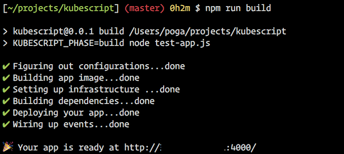

# KubeScript

[](http://github.com/badges/stability-badges)
[](https://standardjs.com)

KubeScript is a web application framework that helps you build scalable web application with plain JavaScript, connect with microservices written in any language.

`npm i kubescript`




## Synopsis

```javascript
const App = require('kubescript')

// require docker images directly
const redisConfig = require('docker://redis')
const redisClient = require('redis')

let app = new App()

app.post('/register', function (ctx) {
  let {host, port} = redisConfig
  let c = redisClient.createClient({host, port})

  register(c)

  app.emit('user.registered')
  ctx.body = 'bar'
})

// event handling
app.on('user.registered', function (ctx) {
})

app.run()
```

Deploy this application to kubernetes with `KUBESCRIPT_PHASE=build node index.js`. One command, everything is automated.

For more example, see `test-app.js`.


## Setup

To start, you need the following tools installed on your computer:

* docker
* kubectl
* [conduit](https://conduit.io/)

You also need a working kubernetes cluster. Currently, only v1.9.7 is tested.

**note**: When using GKE, you need to create a role first:

`kubectl create clusterrolebinding cluster-admin-binding-$USER --clusterrole=cluster-admin --user=$(gcloud config get-value account)`.


## CLI

##### Add a dependency

```
$ npx ks add foobar@1.2.3
```


## API

##### `new App()`

```javascript
const App = require('kubescript')
let app = new App()
```

Create a new KubeScript application.

##### `app.get(path, handler), app.post(path, handler), app.put(path, handler), app.delete(path, handler)`

Create a HTTP endpoint for specified method. `handler` is a [koa](https://koajs.com/) handler.

Routing is done with [koa-router](https://github.com/alexmingoia/koa-router).

##### `app.on(event, handler)`

Subscribe to an event.

##### `app.emit(event, payload)`

Emit an event with given payload.

##### `app.run()`

If `KUBESCRIPT_PHASE` environment variable is set to `build`, it will start building your application.

If not, start the application for runtime.


## Config

You need to add settings to your `package.json`. Here's an example:

```json
{
  "name": "YOUR_APP_NAME",
  "version": "0.0.1",
  ...
  "license": "ISC",
  "dependencies": {
    ...
  },
  "KubeScript": {
    "prefix": "gcr.io/spacer-184617/",
    "dependencies": {
      "foobar": {
        "version": "latest",
        "ports": [
          {
            "name": "http-server",
            "containerPort": 3000
          }
        ]
      },
      "redis": {
        "version": "4.0.9"
      }
    }
  },
}
```

* `KubeScript.prefix`: The string to prepend to your application's docker image name. This is for pushing your image to the correct registry, such as [Google Container Registry](https://cloud.google.com/container-registry/).
* `KubeScript.dependencies`: The microservices your application depends on. The key is the corresponding docker image name. The value includes:
  * `version`: The version you want to use. KubeScript will look for image with specified version tag.
  * `ports`: The service's exposed port. KubeScript will try to find the `EXPOSE` port via inspecting the docker image by default.


## License

The MIT License

